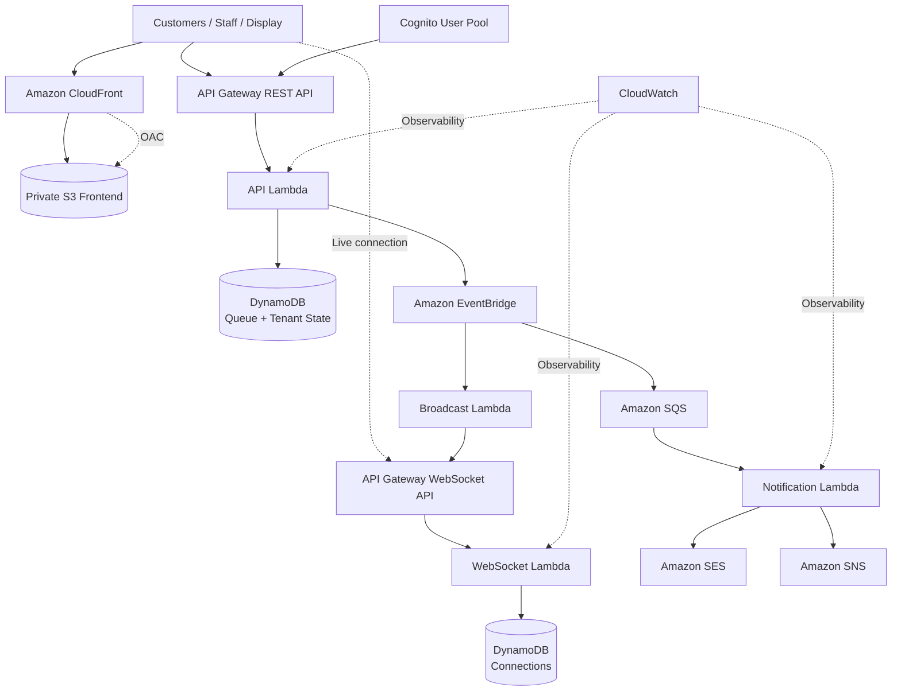
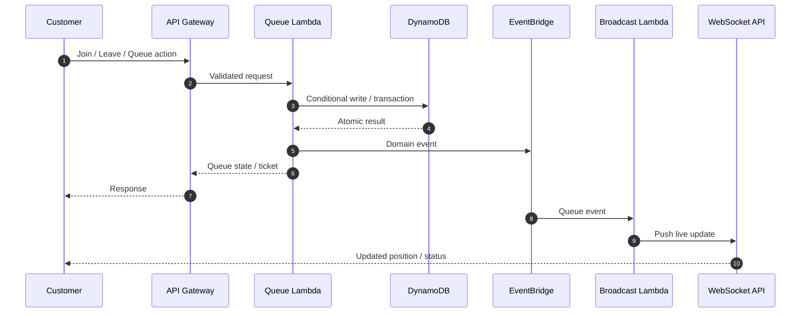
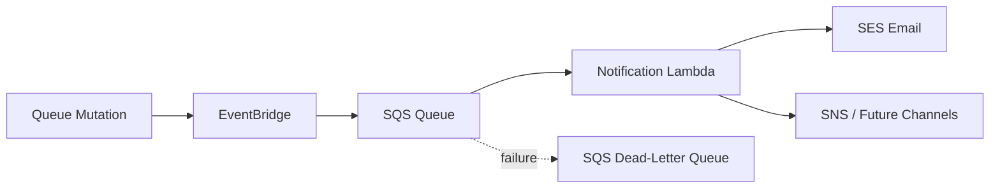
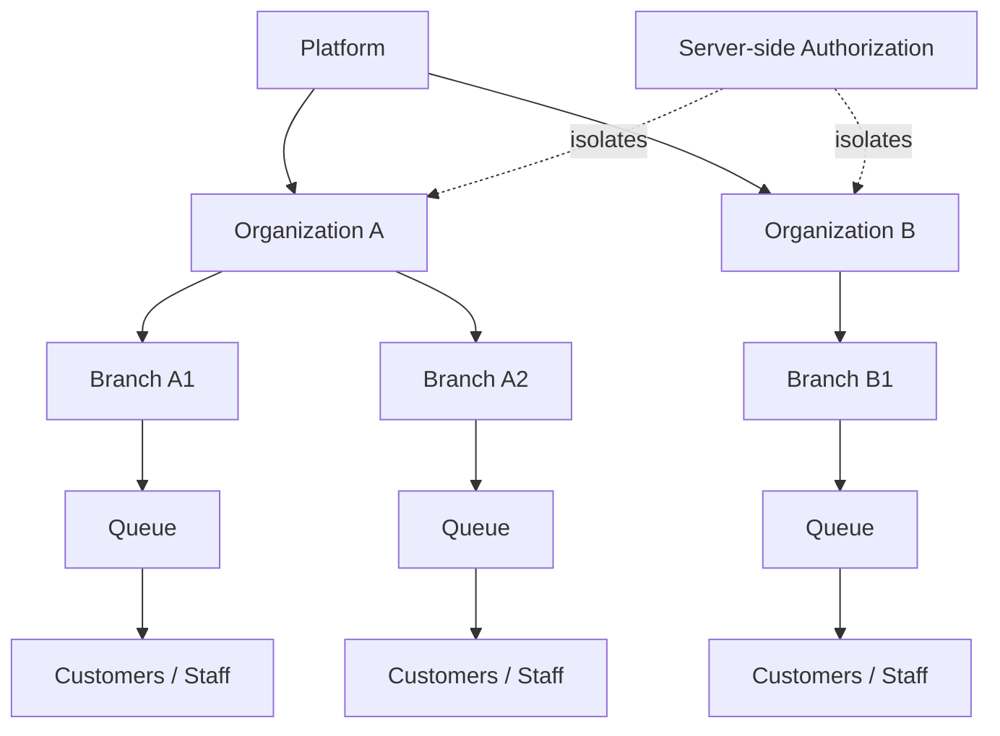

# LineLess

> **Join the Queue. Skip the Wait.**

LineLess is a real-time, serverless virtual queue platform for businesses that want to replace physical waiting lines with a live digital experience.

Customers can join remotely, keep their place on their phone, see live movement and estimated wait time, and receive turn notifications. Staff get a fast queue console for calling, skipping, recalling, pausing, resuming, and closing queues.

[](https://github.com/Ibad84671/LineLess/actions)
[](https://aws.amazon.com/serverless/)
[](https://nodejs.org/)
[](LICENSE)

---

## Why LineLess?

Physical queues create wasted time, crowded waiting areas, unpredictable wait times, and unnecessary pressure on front-desk staff.

LineLess turns the queue into a live digital workflow:

```text
Customer scans QR / opens link
          ↓
      Joins queue
          ↓
  Gets digital ticket
          ↓
Tracks position + ETA in real time
          ↓
  Receives turn notification
          ↓
       Gets served
```

No refresh button. No clipboard. No guessing.

---

## Product Surface

### Customer

- Join a queue without creating an account
- Receive a human-friendly ticket number
- See people ahead and estimated wait
- Follow live queue movement through WebSocket updates
- Leave the queue when plans change
- Receive asynchronous notification events

### Staff

- Secure staff authentication through Amazon Cognito
- Queue dashboard and live board
- Call next customer
- Skip and recall customers
- Pause, resume, and close queues
- View queue/service analytics
- Manage organization, branch, and service data according to role

### Display / Reception

- Dedicated live display route for TVs or reception screens
- Current serving state and queue movement
- WebSocket-powered updates instead of polling

---

# Architecture

LineLess uses a serverless, event-driven architecture. The queue mutation path stays focused on correctness while notifications and real-time fan-out are decoupled through events.

## High-Level AWS Architecture



### Request / Queue Mutation Flow



### Notification Flow



### Multi-Tenant Security Boundary



> **Security principle:** the browser is never the authorization boundary. Tenant and role checks are enforced server-side before protected operations access tenant data.

---

## AWS Services

| Service | Responsibility |
|---|---|
| Amazon CloudFront | Global HTTPS delivery and frontend edge caching |
| Amazon S3 | Private static frontend origin |
| Origin Access Control | Keeps the S3 frontend private behind CloudFront |
| API Gateway | REST API and WebSocket transport |
| AWS Lambda | API, WebSocket, broadcast, and notification compute |
| Amazon DynamoDB | Queue state, organizations, connections, idempotency and operational data |
| Amazon Cognito | Staff authentication and identity |
| Amazon EventBridge | Domain-event fan-out |
| Amazon SQS | Durable asynchronous notification processing |
| Amazon SES | Email notification delivery |
| Amazon SNS | Optional notification channel abstraction |
| Amazon CloudWatch | Logs and operational observability |
| AWS CloudFormation | Infrastructure as code and repeatable deployment |

---

## Engineering Highlights

### Concurrency-safe queue engine

Queue operations use DynamoDB conditional writes and transactions rather than unsafe read-then-write counters. The test suite exercises simultaneous joins, concurrent `CALL NEXT`, leave/next races, pause/close races, and duplicate customer attempts.

### Idempotency

Mutating operations support idempotency semantics so client retries do not accidentally create duplicate queue actions.

### Multi-tenancy

The application models organization → branch/service → queue boundaries and uses tenant-aware access checks. Authorization is enforced server-side.

### Real-time state

Queue changes emit domain events that feed the broadcast path. Connected clients receive state changes over API Gateway WebSockets instead of repeatedly polling the API.

### Async notifications

Notifications are separated from the critical queue mutation path using EventBridge and SQS. Delivery failures can therefore be retried without blocking queue operations.

### Private frontend origin

The S3 frontend bucket is not intended to be publicly readable. CloudFront accesses it through Origin Access Control.

---

## Repository Layout

```text
LineLess/
├── backend/
│   └── src/
│       ├── functions/          # Lambda entry points
│       ├── routes/             # REST route handlers
│       ├── services/            # Queue, org, analytics, notifications, WS
│       └── shared/              # Auth, DynamoDB, validation, events, logging
├── frontend/
│   ├── assets/
│   │   ├── css/
│   │   └── js/
│   │       └── views/
│   ├── config.example.js
│   └── index.html
├── infrastructure/
│   └── lineless.yaml            # CloudFormation source of truth
├── scripts/
│   ├── build.js
│   ├── deploy.ps1
│   ├── destroy.ps1
│   ├── package-backend.js
│   ├── static-checks.js
│   └── dev-server.js
├── tests/
│   ├── unit/
│   ├── integration/
│   ├── infra/
│   └── websocket/
├── docs/
├── .github/workflows/
├── package.json
└── README.md
```

---

## Quality Gates

Current baseline:

```text
Unit             ✓
Integration      ✓
CloudFormation   ✓
WebSocket        ✓
--------------------
Total            58 / 58 PASS
```

Run the complete suite:

```powershell
npm test
```

Run static/security checks:

```powershell
npm run check
```

Build the frontend/package artifacts:

```powershell
npm run build
```

---

## Local Development

### Prerequisites

- Node.js 22+
- AWS CLI configured for the target account when deploying
- PowerShell on Windows

Install dependencies:

```powershell
npm ci
```

Start the local application:

```powershell
npm run dev
```

Runtime configuration is intentionally separated from source code. Never commit credentials, tokens, or environment secrets.

---

## AWS Deployment

Infrastructure lives in `infrastructure/lineless.yaml` and deployment automation lives in `scripts/`.

```powershell
./scripts/deploy.ps1 -Environment dev
```

Destroy the environment:

```powershell
./scripts/destroy.ps1 -Environment dev
```

The deployment workflow validates prerequisites, tests the project, packages Lambda code, uploads the artifact, validates CloudFormation, creates/updates the stack, and publishes the frontend according to deployment outputs.

**Never paste AWS access keys, secret keys, session tokens, or GitHub tokens into source files or commit history.**

---

## Security Model

- Private S3 origin behind CloudFront Origin Access Control
- S3 Block Public Access
- Least-privilege Lambda IAM roles
- Cognito-backed staff authentication
- Server-side authorization and tenant isolation
- DynamoDB conditional writes for state integrity
- Input validation and bounded fields
- Idempotency for retry-sensitive mutations
- No credentials in frontend source
- Asynchronous notification processing through SQS
- Static secret/account/placeholder checks

See `docs/` for deeper security, deployment, architecture, and testing documentation.

---

## Design Principles

1. **Correctness before cosmetics** — queue state must remain consistent under concurrency.
2. **Server-side trust boundaries** — frontend state is never authorization.
3. **Events for decoupling** — notifications and broadcasts should not make queue mutations fragile.
4. **Infrastructure as code** — CloudFormation is the deployment source of truth.
5. **Observable failures** — errors should be diagnosable from logs and deterministic tests.
6. **Cost-conscious serverless** — avoid always-on infrastructure where managed serverless primitives are sufficient.
7. **Progressive enhancement** — customers should join with minimum friction.

---

## Roadmap

### Production hardening

- [ ] Production browser smoke tests
- [ ] CloudWatch operational dashboard
- [ ] Stronger API rate limiting / WAF configuration
- [ ] Production notification configuration and delivery tests
- [ ] Deployment / rollback runbook

### Product expansion

- [ ] Multi-branch management UI improvements
- [ ] Advanced queue analytics and peak-hour visualizations
- [ ] Appointment + walk-in hybrid queues
- [ ] Configurable customer notification channels
- [ ] PWA install experience
- [ ] Business branding/customization

### Future / optional

- [ ] Predictive wait-time models
- [ ] Voice announcements
- [ ] Additional messaging providers
- [ ] Advanced operational forecasting

Features are not advertised as complete until their backend, infrastructure, UI, tests, and documentation are actually implemented.

---

## Project Status

**Engineering baseline:** functional serverless queue platform with a concurrency-focused test suite and CloudFormation deployment automation.

The project is being hardened in stages. Production readiness is only claimed after implementation and verification of the relevant capability.

---

## License

MIT — see [LICENSE](LICENSE).

## Author

Built by **Ibad Shaikh** as an AWS/serverless architecture portfolio project.

**LineLess — Join the Queue. Skip the Wait.**